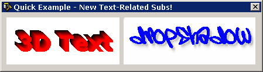



## Enhance Image FX Module \*Emulate Photoshop Filters \[update: Sept 22\]

### Description

*UPDATED: Sept 22, 2001

This clever module (BAS file) emulates some of Adobe Photoshop's most useful features and filters. Includes: Add Noise, Blur, Colorize, Darken, Flip Horizontal, Gradient, Invert Colors, Lighte, Merge, Merge Gradient, Pixelate (Mosaic). Now including: Replace Color, Stroke, TV Scan Lines; as well as Text Effects: 3D Gradient Text, Text with *REALISTIC* Drop-Shadows, Border-Only Text, Text with *REALISTIC* Outter Glows. Uses *ONLY* GetPixel and SetPixel. Check it out and please vote for me if you find it useful :] - Take a look at ths screen shot for examples. ZIP File includes only the module (BAS file). Sorry, didn't have time to code an example project :( Perhaps someone would like to do the honors and post it, if so drop me a line when it's finished? :) PLEASE please please leave comments/questions/suggestions :)
 
### More Info
 

             |
---                |---
**Submitted On**   |2001-07-02 02:14:58
**By**             |[Patrick Moore \(Zelda\)](https://github.com/Planet-Source-Code/PSCIndex/blob/master/ByAuthor/patrick-moore-zelda.md)
**Level**          |Beginner
**User Rating**    |4.9 (34 globes from 7 users)
**Compatibility**  |VB 4\.0 \(32\-bit\), VB 5\.0, VB 6\.0
**Category**       |[Graphics](https://github.com/Planet-Source-Code/PSCIndex/blob/master/ByCategory/graphics__1-46.md)
**World**          |[Visual Basic](https://github.com/Planet-Source-Code/PSCIndex/blob/master/ByWorld/visual-basic.md)
**Archive File**   |[Enhance Im268269222001\.zip](https://github.com/Planet-Source-Code/patrick-moore-zelda-enhance-image-fx-module-emulate-photoshop-filters-update-sept-22__1-22970/archive/master.zip)

